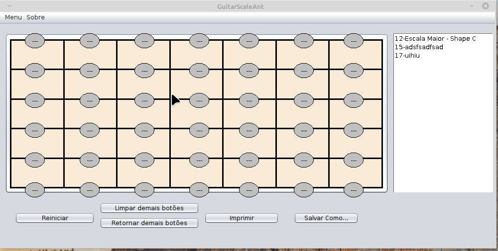

# GuitarScaleAnt

Software desenvolvido em Java para auxiliar professores e estudantes de violão e guitarra. Ele permite desenhar escalas musicais no braço do instrumento, determinar as sequências de dedos para cada corda e destacar em vermelho a tônica da escala.

## Demo



### 🔧 Funcionalidades principais

* **Desenho de escalas**: Visualize escalas musicais no braço do violão ou guitarra.
* **Sequência de dedos**: Indique a ordem dos dedos a serem usados em cada corda.
* **Destaque da tônica**: Identifique facilmente a tônica da escala, destacando-a em vermelho.

### 📥 Como instalar e executar

1. Baixe o arquivo ZIP do repositório: [GuitarScaleAnt.zip](https://github.com/IgorAvilaPereira/GuitarScaleAnt/archive/refs/heads/main.zip)
2. Extraia o conteúdo do arquivo ZIP.
3. Vá até a pasta `/src` e copie o arquivo `database.db`.
4. Cole o arquivo copiado na pasta `/dist`.
5. Execute o arquivo `GuitarScaleAnt.jar` para iniciar o aplicativo.

## 🧪 Tecnologias Utilizadas

* Java (JDK): Linguagem principal do projeto.

* Swing: Biblioteca de GUI usada para desenhar a interface gráfica (botões, janelas, etc.).

* AWT (Abstract Window Toolkit): Utilizado junto com o Swing para desenho gráfico no braço do violão.

* SQLite: Banco de dados local usado para armazenar escalas e dedilhados.

### 📂 Estrutura do repositório

* `src/`: Código-fonte do aplicativo.
* `dist/`: Arquivos compilados e recursos necessários para a execução.
* `database.db`: Banco de dados utilizado pelo aplicativo.
* `README.md`: Documentação do projeto.

### 🎓 Público-alvo

Este software é ideal para professores e estudantes de violão e guitarra que desejam visualizar e praticar escalas musicais de forma interativa. Ele facilita o aprendizado e o ensino de escalas, tornando o processo mais visual e intuitivo.

Se você está interessado em explorar escalas musicais no violão ou guitarra, o GuitarScaleAnt é uma ferramenta útil e acessível.

<!--

## Instalação/Execução

### Modo Gráfico

0) Extraia o zip baixado através do link https://github.com/IgorAvilaPereira/GuitarScaleAnt/archive/refs/heads/main.zip
1) Vá até a pasta **/src** e copie o arquivo **database.db**
2) Cole na pasta **/dist**
3) O executável **.jar** está na pasta **/dist**. 
4) Execute o arquivo clicando 2x no **.jar** da pasta **/dist**. 

## No terminal 

0) Extraia o zip baixado através do link https://github.com/IgorAvilaPereira/GuitarScaleAnt/archive/refs/heads/main.zip
1) Vá até a pasta **/src** e copie o arquivo **database.db**
2) Cole na pasta **/dist**
3) O executável **.jar** está na pasta **/dist**. 
4) Execute:
```
java -jar GuitarScaleAnt.jar 
```
-->
