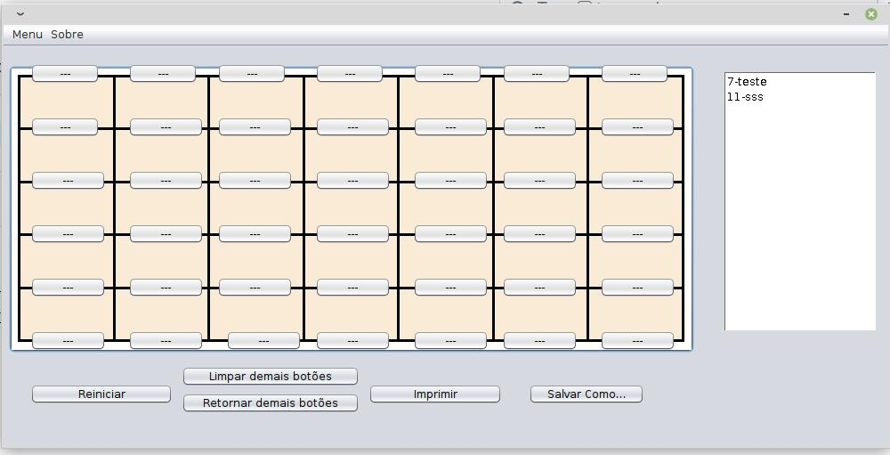

# GuitarScaleAnt

Software desenvolvido em Java para auxiliar professores e estudantes de violão e guitarra. No GuitarScaleAnt é possível _desenhar_ escalas e determinar a sequências dos dedos que devem tocar cada corda. Além disso, é possível destacar _em vermelho_ qual a tônica da escala.




## Executar

O executável **.jar** está na pasta **dist**. 
Funcionará clicando 2 cliques ou pelo terminal. 

No terminal execute:

```
java -jar GuitarScaleAnt.jar 
```
